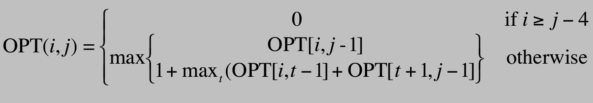

# Nussinov algorithm acceleration with CUDA and GPU

## Overview

The project would like to use CUDA GPU to accelerate the Nussinov algorithm in a RNA sequence. In a sequence, there are only 4 alphabet inside: {A, C, G, U}. The algorithm tries to find out the maximum number of Watson-Crick pair, which are: {A-U, U-A, C-G, G-C}. However, the RNA sequence can be pretty long and thus takes lots of time to compute. Originally the algorithm takes O(n^3) time complexity to solve the problem with CPU code. In this project, we test the sequence length from 48 to 32768 using CUDA to parallelize the computation and optimize the time complexity to O(n^2).

## Parallelization & Parallel Pattern

The algorithm is related to dynamic programming, which utilized a 2D matrix(OPT) to do the calculation. The dimension of the OPT matrix would be `OPT[N][N]` , where `N` is the length of the RNA.

Each element in the OPT 2D matrix would be the equation of below:

To explain the condition:

- 0: the sharp turn condition that each pair of alphabet are separated by ≥ 4 other alphabets
- $OPT[i][j-1]$: check the number of pairs **excluding** the current pair
- $OPT[i][j] == 1 + OPT[i][t-1] + OPT[t+1][j-1]$: check the number of pairs **including** the current pair
  - `1` means the current `i`, `j` pair
  - `OPT[i][t-1]` means to consider the previous optimal number of pairs before `i`, which means to consider the pairs outside `i`, `j`
  - `OPT[t+1][j-1]` means to consider the inner optimal number of pairs between `i` and `j`.

The above formula it takes 3 nested for loop in order to complete the computation. Below explain the detail about how CPU traverse the matrix and how to use CUDA kernel to do the parallel compute.

### Global Parallel

The order that the algorithm calculate/traverse each element of `OPT[i][j]` would be as below left image. It would traverse the diagonal part of the matrix. Each element will need the previous matrix calculation result. Since element doesn’t need the result on the same column to calculate the maximum pairs, the place where we can accelerate with parallelization is column by column as the right image below. Each time we put one column into the kernel, and the element inside the column can be calculated in parallel by GPU.

Below uses the matrix result by DNA sequence `ACCGGUAGUC` (length = 10) as visualization

the order that the element be calculated on CPU

each column is put into the kernel separately on GPU

Therefore, for the dimension of block and grid, we cannot use a square block / grid. That’s also because we need need the previous columns’ result in order to calculate correctly.

Therefore, the block we have to use is a 1D dimension with x= 1, y = row length, z = 1.

However, due to the maximum of block dimension is 1024, the above situation can only use when RNA’s length `N` is less than 1024. When the situation is larger than 1024, we need another block in order to do the calculation. That’s where the place grid has to setup.

When `N` > 1024, let’s take `N = 4096` as example. This time we also need to calculate the matrix in column order, but we use `grid = 4096 / 1024` means that there are 4 blocks inside the grid. And use this setup to do the calculation.

We can also get the index of the element (`OPT[i][j]`) using the threadIdx, blockIdx and blockDim.

## Result & Comparison of Algorithm

For checking the result correctness, I first check compare the CPU algorithm with other Nussinov algorithm, verify that the result is the same as others.

For the result, since the purpose is to find out the maximum pairs of the input RNA sequence, so we can first check the pairs each kernel found. If we want to check more detail, we can see if the OPT matrix are the same between CPU and GPU kernel. The right image is the screenshot of the terminal about one of my testing.

Below is the execute time for different sequence length, timing, and the result. Since it would take more than 3 hours to run a length > 10000 RNA, and our AWS Appstream cannot use for that long time, the length over 10000 will only have the GPU result. The time is showed in second.

| RNA length | CPU Time (s) | GPU Time (s) | CPU result global | GPU result global |
| ---------- | ------------ | ------------ | ----------------- | ----------------- |
| 48         | 0.001000     | 0.269000     | 15                | 15                |
| 128        | 0.003000     | 0.011000     | 40                | 40                |
| 512        | 0.164000     | 0.152000     | 182               | 182               |
| 1024       | 1.345000     | 0.264000     | 366               | 366               |
| 2048       | 13.56000     | 1.419000     | 736               | 736               |
| 4096       | 139.67400    | 5.836000     | 1486              | 1486              |
| 8192       | 1339.83900   | 24.230000    | 2964              | 2964              |
| 16384      | Nah (> 3hrs) | 101.775000   | Nah               | 5932              |
| 25600      | Nah (> 3hrs) | 267.654000   | Nah               | 9284              |
| 32768      | Nah (> 3hrs) | 490.56000    | Nah               | 11887             |

GPU compute is way more faster than CPU when the length is larger and larger. When length is 8192, it takes about 24 minutes for CPU to complete the computation while GPU only takes 24 seconds. And when the length is 32768, CPU cannot complete the task under 3 hours while GPU only takes about 8 minutes to solve the problem. Using parallel GPU compute saves a huge amount of time.

The above image is the OPT matrix result generated by CPU and GPU. The length of the input RNA is 12.
And we can see the OPT for both matrix are the same.
